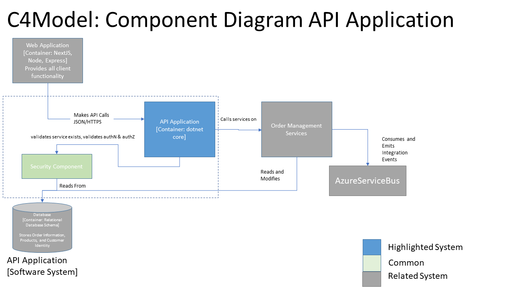
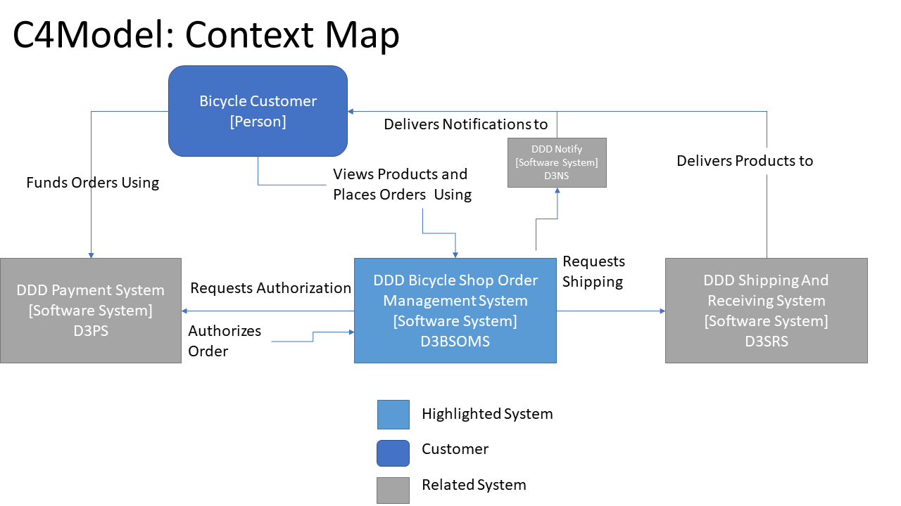
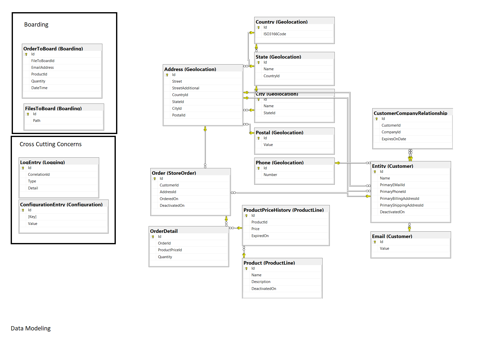
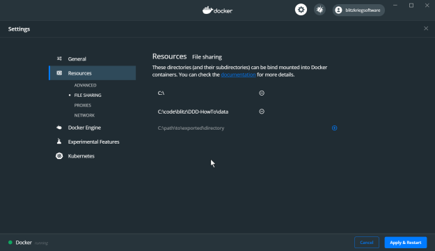
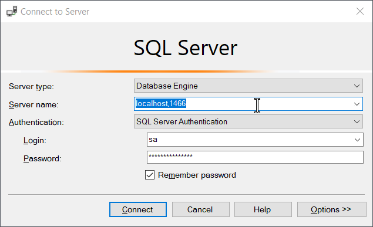
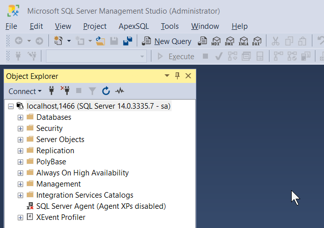
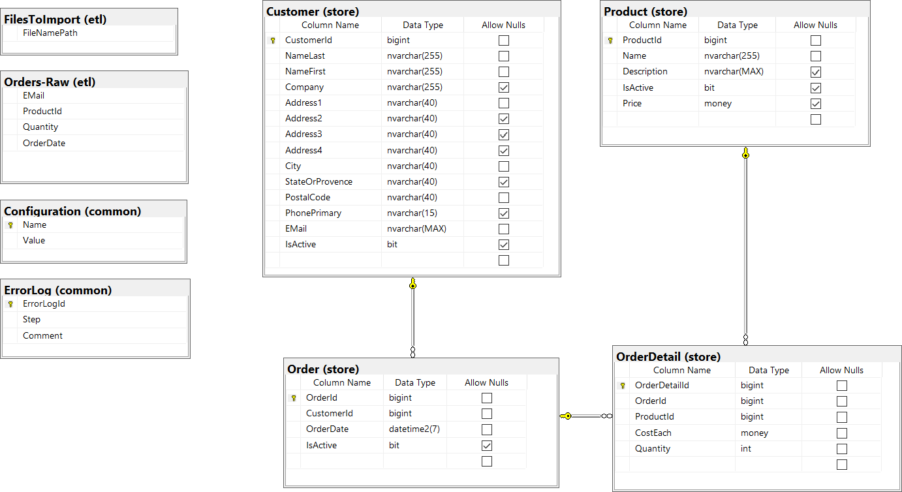

# DDD Magenic Masters Class

# Notes:

Adding Steve Kaplin to the project.
Changing the focus of the Project from a Bicycle Shop to a Custom Computer Build Shop (Along the lines of Dell,Gateway).


## Purpose

Homework and final project for the DDD Magenic Masters Class

## Requirements

Weekly Pull Request:

* Domain(s) and other DDD artifacts
* Full code documentation e.g. XML comments in C#, etc.
* Serialization Test of all concrete classes
* Functional (Unit) tests of all adaptors, factories, etc. (80% code coverage)
* Pull-Request when ready to instructors
* Follow all the requirements for each homework carefully
* CODE is the primary deliverable
* Homework and final project can be done individually or in teams

Additional requirement added 10:31 AM at 6/1/2021

any/all of:	
* DDD Diagrams in UML/MS/C4 Notation
* Classes, Enums, etc. e.g. classes and namespaces
* SQL or other schema that represents the mapping of DDD to storage


### Milestones

#### first week, update README

"Pick a project. Either the Magenic "Store" project or the one in the slides, or... And tell us all about it via the README.md in your PR"

Notes:

Of the two forked projects, the one from the slides, and the Magenic fork, the Magenic fork seems contain more details. The other project only contained one model. It is my intent to select the Magenic fork, and hopefully more details will make themselves apparent in the following lectures. The bulk of DDD from my understanding is the discussion with the business, attempting to guess at intent will not yield a ubiquitous language, or give us enough information to pick the appropriate objects as roots.

The bicycle  DB diagram gives us "data modeling" but not a keen insight into the domains. The "data model" does not seem at first glance to follow a highly normalized standard. DDD seems to indicate we should disregard persistence until such time as domain modeling has finished. In practice writing defensively to protect against code that cannot be tested, or persisted seems like you might need it, in fact most systems expect some amount of persistence, disregarding YAGNI for this specific case seems prudent. 

I have added a docs folder with the following:

* docs/ubiquitous-language.md
* docs/vision-statement.md
* docs/maps/

It is my intent:
    * to update the language as we agree upon the terms. 
    * to populate the vision statement once more information can be ascertained.
    * to add maps as the domain exploration, and code cartography allows

#### first week, additional

Added initial maps:

* 
* 
* 
* 
* 

### Codebase
    We will track our codebase in github

### Dependencies
    We will declare dependencies as packages used by Nuget, other dependencies excluding system dependencies which can not be packaged will be declared with the prefix External

### Config
    Our configuration should align with the standard dotnet core configuration library using the IOptions<T> pattern

### Backing Services
    For the purpose of this project it is unclear what backing services we will have.

### Build, Release, Run
    If time permits Github Actions could serve this purpose, and a build/release/run should be seperated at the time of creation

### Processes
    The app will attempt to limit state and strive to be stateless

### Port binding
    The application will expose apis via a port defined in the configuration. It is the intent to expose a JSON Api which will follow the OpenApi standards.

### Concurency

### Disposability

### Dev/Prod parity
    While not an immediate concern as it appears to be out of scope of the course, code introduced should be aware of this requirement and not use patterns and practices which will limit future development.

### Logs
    Logging will be done using commonly available dotnet tooling. logs will be time ordered and placed in the log directory. It is the intent that nothing should impede the consumption as a stream.

    Source control will ignore this folder.

### Admin Processes
    Admin/processes will be executed as one off. A source controlled record of execution should be placed in the one-off-process folder in the root.

    Source control will ignore this folder.


# Previous getting started _will be removed after additional details are finalized_

## Getting Started

Domain Driven Design

## Prerequisites

0. Install or Update [GIT](https://git-scm.com)
1. Install or Update [Docker](https://www.docker.com/products/docker-desktop)
2. Install or update the [.NET Core 3.1 LTS SDK](https://dotnet.microsoft.com/download/dotnet-core/3.1)
3. Install or Update [VSCode](https://code.visualstudio.com/download) or [Visual-Studio](https://visualstudio.microsoft.com/downloads/), or your favorite code editor for **C#**

## Pull the source code

```sh
cd $mygitroot
git clone https://github.com/Magenic/DDD.git
cd DDD
```

## Set up and reboot docker

In the docker settings, add the `DDD/Data` folder to the *Settings/Resources/File Sharing*



> Apply and restart docker!

## Folders

* Code/ - Code
* Data/ - Data and helpers
* Scripts/ - Docker Scripts to spin up/down SQL Server for code demos

## Scripts

> All of the script are designed to be used with [GIT-BASH](https://git-scm.herokuapp.com/book/en/v2/Getting-Started-The-Command-Line)

The sample code will use a linix based Docker container image of [Microsoft SQL Server 2017](https://hub.docker.com/_/microsoft-mssql-server) where the port for sql of ~~1433~~ is remapped to **1466** to avoid colliding with any local instances you may have.

If you need to modify the scripts to suit your particular needs you can modify the [environment variables](https://docs.microsoft.com/en-us/sql/linux/sql-server-linux-configure-environment-variables?view=sql-server-2017) as desired.

## How to use the provided scripts

Start by changing directory to `scripts/`

```bash
cd scripts
```

### Start Docker Image

```bash
./start-sql.sh
2017-CU21-ubuntu-16.04: Pulling from mssql/server
Digest: sha256:586a0e2535f191c59ff7b9aa1a70ae03bac0747ef0d2021cdea24326bcf2c3e4
Status: Image is up to date for mcr.microsoft.com/mssql/server:2017-CU21-ubuntu-16.04
mcr.microsoft.com/mssql/server:2017-CU21-ubuntu-16.04
4a771b7bf116b9b0acdbb6ecd005346a7163f31d48520ddbcaca1e08cd4a546b
SQL Running on Port: 1466
```

> **Info:** SQL Server takes a while to start, so give it a few minutes to get up and running 

This will install and start SQL:

* Address: `localhost,1466`
* Username: `sa`
* Password: `ddd20demoSQL-`
* Port: `1466`

Docker Info:

* Container Name: `ddd-sql`
* Image: `mcr.microsoft.com/mssql/server:2017-CU21-ubuntu-16.04`

### Stop Docker Image

```bash
./stop-sql.sh
```

### Bash Shell into SQL Server Docker Image

> Warning: You will be `root`

```bash
./cli-bash.sh
# 
```
Use `exit` to close the shell

### SQLCMD on SQL Server Docker Image

This will open the command line SQLCMD prompt:

```bash
./prompt-sql.sh
1> 
```

Use `exit` to close the shell

### Connection String for C# ADO or Entity Framework

```cs
var connectionString = "Server=localhost,1466;Database={Insert DB Name here};User Id=sa;Password=ddd20demoSQL-;"
var connectionString = "Server=localhost,1466;Database={Insert DB Name here};User Id=sa;Password=ddd20demoSQL-;"
```

### SQL Server Management Studio

If you want to use [SSMS](https://docs.microsoft.com/en-us/sql/ssms/download-sql-server-management-studio-ssm) 

1. Download or update it

2. Start it
 
3. In the new connection dialog


4. Use SSMS as usual



## Bicycle Schema



## YouTube Videos related to DDD

[YouTube DDD Videos](https://www.youtube.com/user/spookdejur1962/search?query=DDD)

## About Us

> Stuart Williams
> Larry Smithmier 
> Rocky Lhotka 

From Fork:
An open-source sample project demonstrating how to implement Uncle Bob's Clean Architecture practice called "Screaming Architecture" in ASP.NET MVC 5.


For step-by-step instructions on how to implement this practice, please read the following tutorial:
http://www.matthewrenze.com/articles/clean-architecture-in-asp-net-mvc-5


