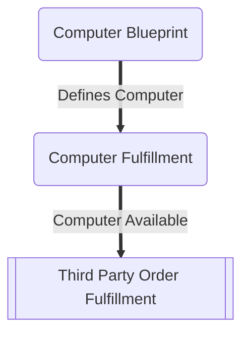
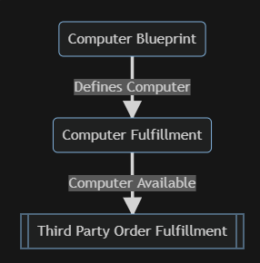
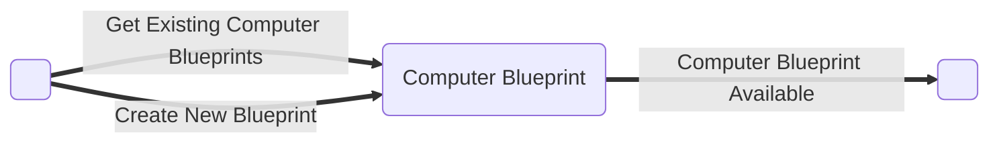
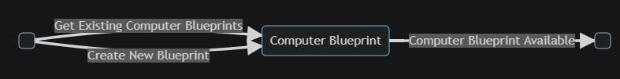
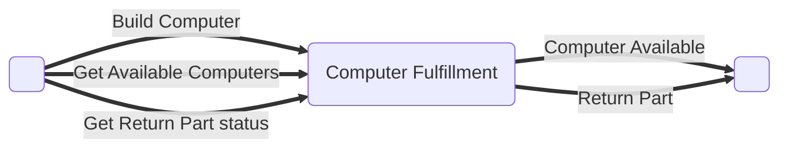
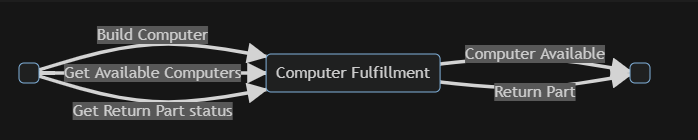

# Drawings

## Context Map

This context map contains the two business domains and a represents a third 
party order fulfillment that is outside of our business.

## Computer Blueprint

The computer blueprint context provides the definition of the parts to assemble
a computer product.

## Computer Fulfillment

The computer fulfillment assembles a computer product to sell from a predefined
blueprint. Computer fulfillment tests completed computers before they are
available for ordering. When vendor parts fail, computer fulfillment is responsible
for interacting with the vendor.

## Third Party Order Fulfillment

Wrapper for Order Fulfillment COTS solution such as Amazon that can handle
warehousing, orders and payments for the business.